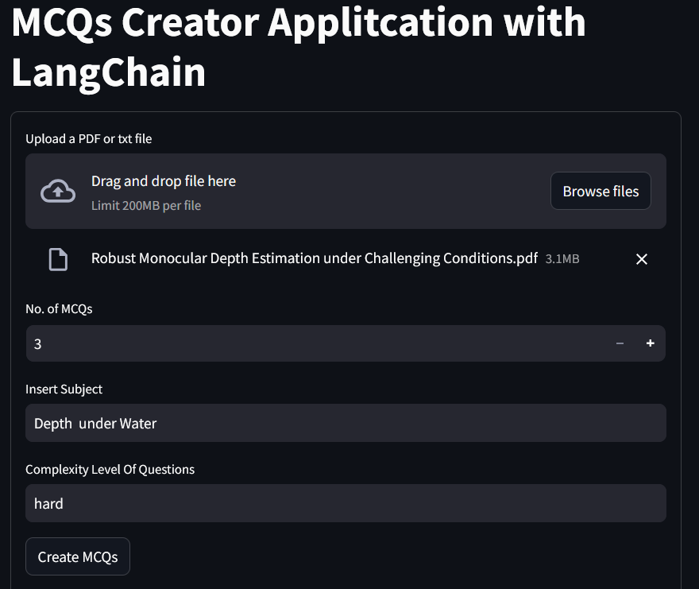
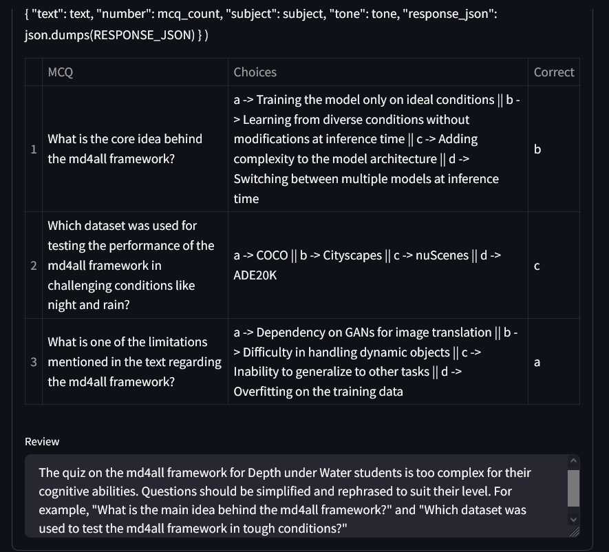

# 🚀 Multi-Choices Question Generator 🚀

---

## Description

Small web app using OpenAI with the LangChain library to create Multiple-Choice Questions (MCQs) with a Streamlit interface.

The app allows you to upload a .txt or .pdf file and uses the OpenAI API to analyze the content, generate questions with multiple-choice answers, and provide the correct answer relevant to the text.

Additionally, below the questions and answers table, a short feedback section about the generated text will be displayed.
---

    

---

---

    

---

## Installation and Setup

### Step 1: Install the Program

Run the following command to set up the program:

    $ python setup.py

### Step 2: Configure Your OpenAI API Key

To make the program runnable, you need to retrieve your OpenAI API key and either:

- Set it as an environment variable, or
- Add it directly to the code in MCQGEN/src/mcqgenerator/MCQGenerator.py at line 23:
  
    #Delete the "#" symbol
    openai_api_key = "your_api_key_here"

Steps to Retrieve the OpenAI API Key:

- Log in to OpenAI API.
- Navigate to Dashboard → API Keys.
- Click on Create new secret key.
- Copy the generated API key.

### Step3: Run the programm

    $ streamlit run StreamlitAPP.py

---